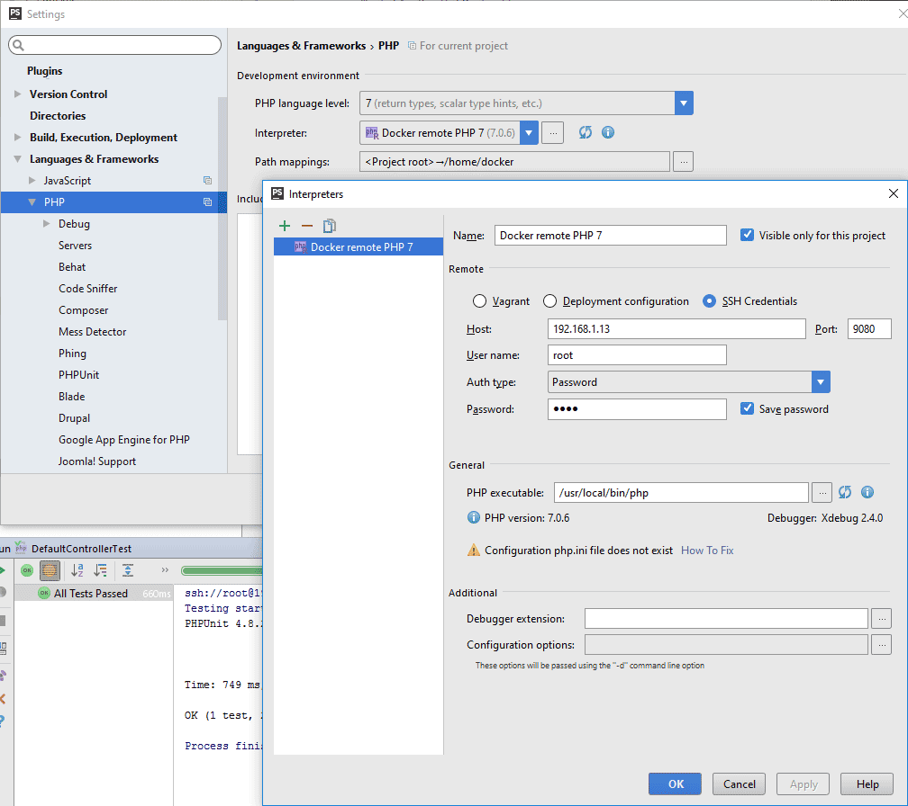

Symfony Docker
==============

## Docker

- Configure host's local ip address (docker/engine/php.ini line 6):
   * native: default local network.
   * virtual(box): virtualbox local network.

## PhpStorm

- Php interpreter must be set.

- XDebug must be configured:

    - Detect path mappings from deployment configuration.
    - Debug port : 9090 
    - "Can accept external connections" checked.
- Server must be set:

    - Configuration name must be the same as docker-compose.yml line 29 (PHP_IDE_CONFIG).
    - path mappings:
        - / => /home/docker
        - /wev/app_dev.php => /home/docker/web/app_dev.php

## Start

- ```docker-compose up -d```