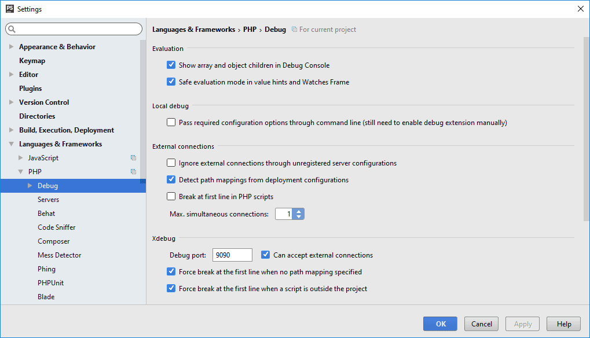

Symfony Docker
==============

## Docker

- Configure host's local ip address (docker/engine/php.ini line 6):
   * native: default local network.
   * virtual(box): virtualbox local network.

## PhpStorm

### Server configuration

- Configuration name must be the same as docker-compose.yml line 29 (PHP_IDE_CONFIG).
- path mappings:
    - / => /home/docker
    - /wev/app_dev.php => /home/docker/web/app_dev.php

### Php interpreter configuration


### XDebug configuration

- Pass required configuration options through command line (...) unchecked. 
- Detect path mappings from deployment configuration.
- Debug port : 9090 
- "Can accept external connections" checked.

### PhpUnit configuration


## Start

- ```docker-compose up -d```